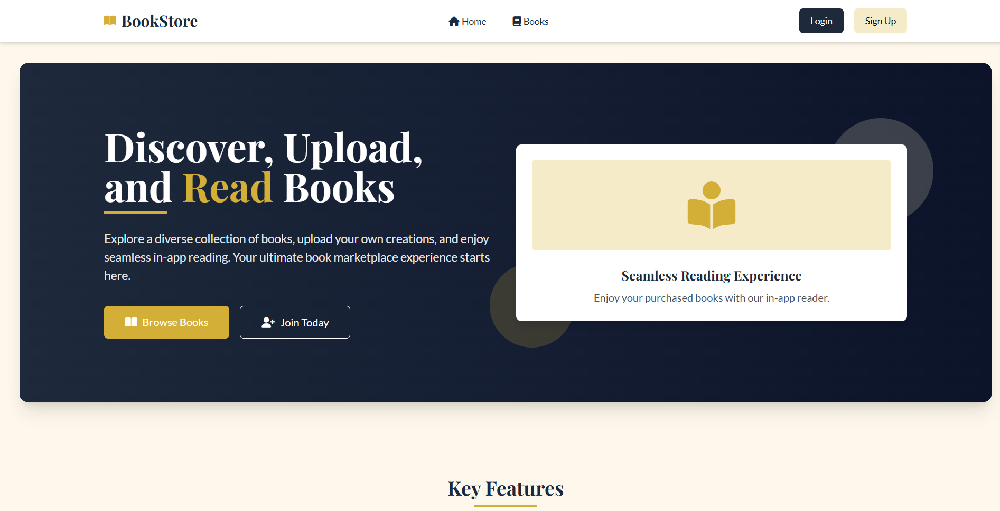
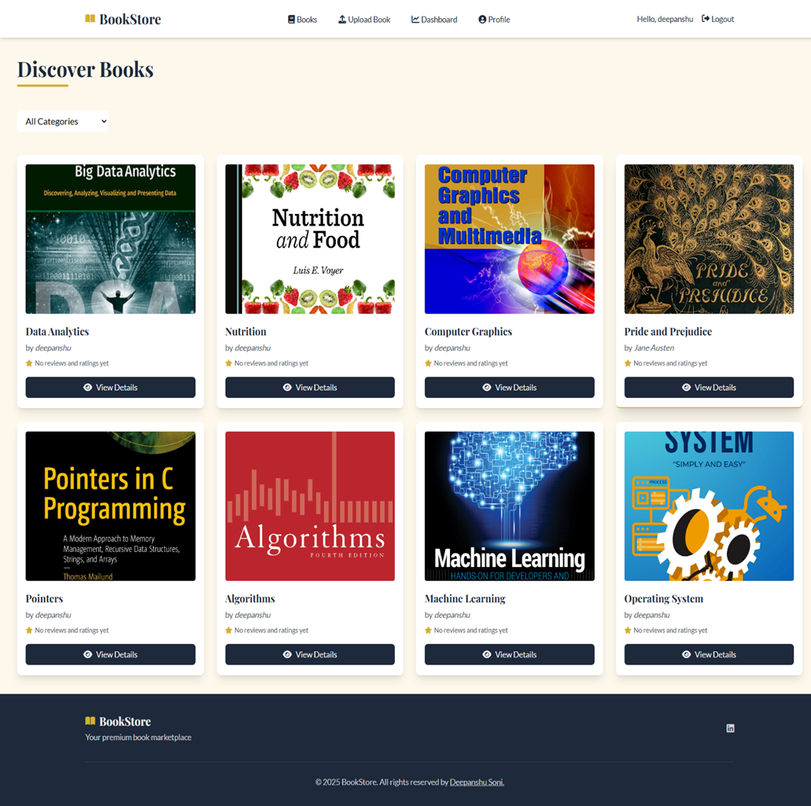
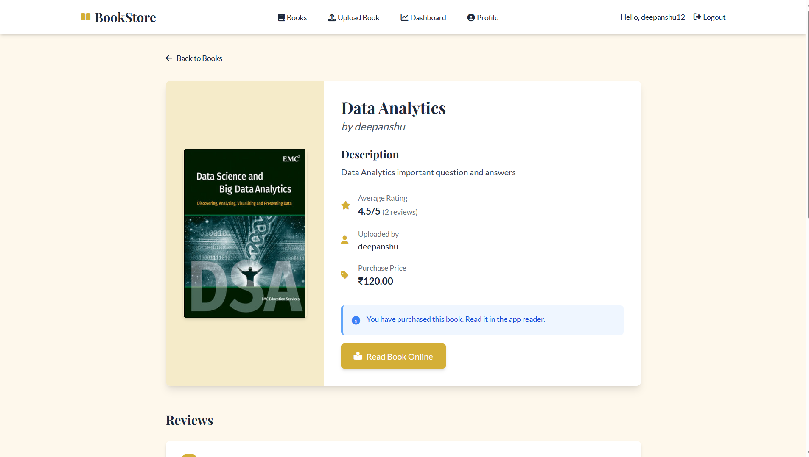
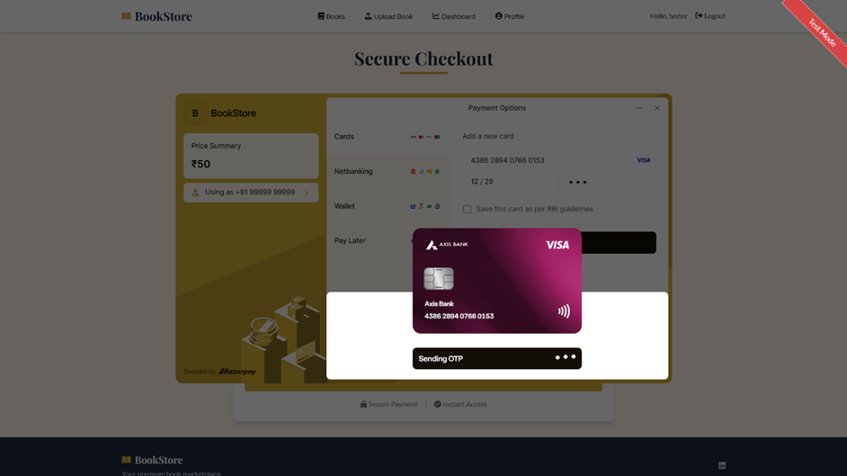
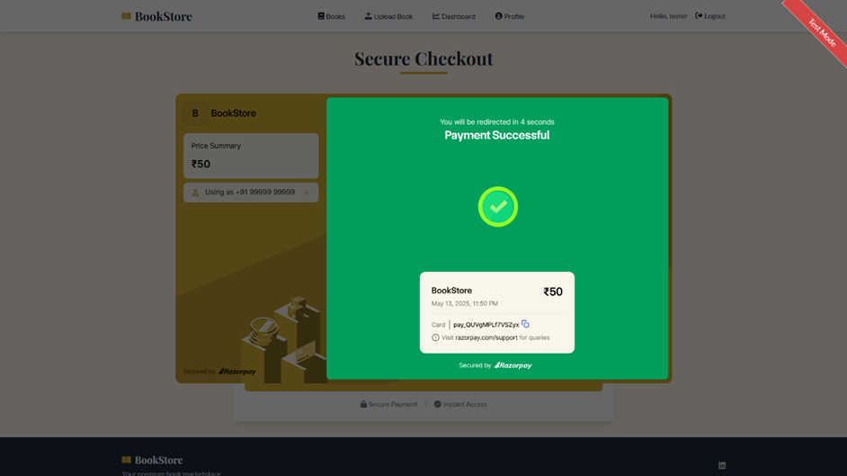
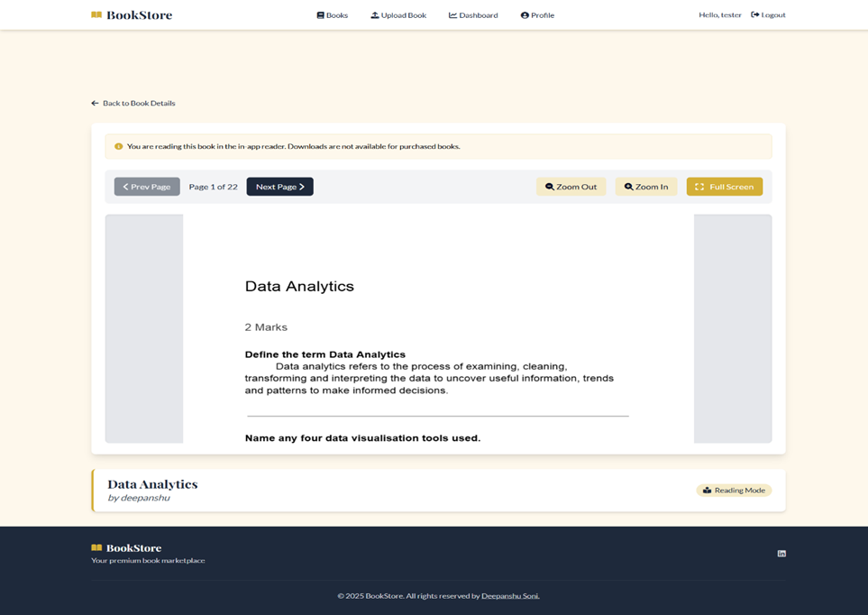
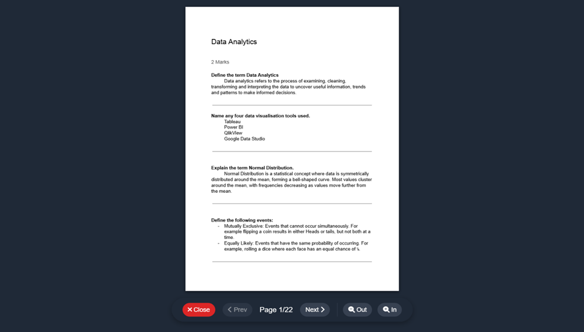
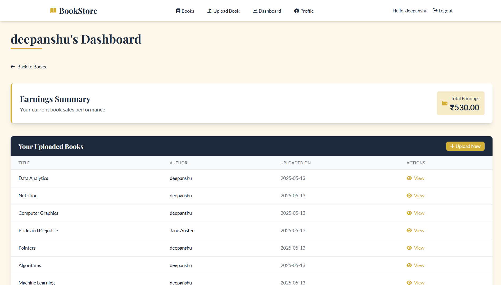

## Final Year College Project: Online Bookstore

This is my final year college project, an online bookstore built in Django. It allows users to browse, upload, buy, and read digital books (PDFs) securely within the application.

## 📷 Screenshots

### Home Page

### Books Catalog Page

### Book Details Page

### Payment Page

### In-App Reader

### User Dashboard

---

<!-- ## 🎥 Video Demo

Watch the full demo of the application here:  

--- -->

## ✨ Key Features:
* **User Accounts:** Users can sign up and log in.
* **Book Management:** Users can browse the book catalog or upload their own PDF books.
* **Purchasing:** Books can be bought using the Razorpay payment gateway.
* **Secure Reader:** Purchased books can only be read inside the app's secure reader; they cannot be downloaded by buyers.
* **Dashboard:** Uploaders have a dashboard to track their book sales and earnings.

## ⚙️ Technology Used:
* **Backend:** Python (Django)
* **Frontend:** HTML, CSS (Tailwind), JavaScript
* **Payments:** Razorpay API

## 📈 Project Status
This project is a completed college final project and is not intended for production deployment without further security audits and production-ready configurations.

## 🤝 Contributing
This project is primarily for academic purposes. Contributions are not expected, but feel free to fork and experiment!

## 🧑‍💻 Author
* Deepanshu Soni
* [Github Profile](https://www.github.com/deepanshuSoni22)
* [LinkedIn Profile](https://www.linkedin.com/in/deepanshu-soni22)
